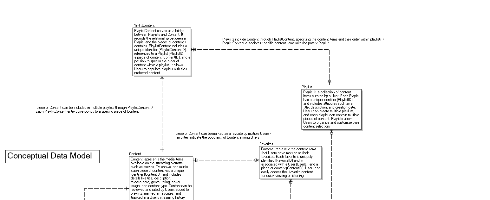
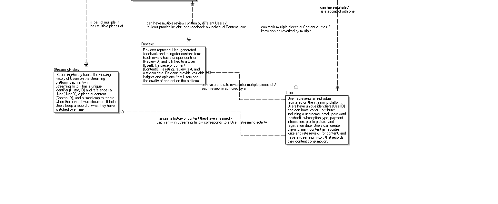
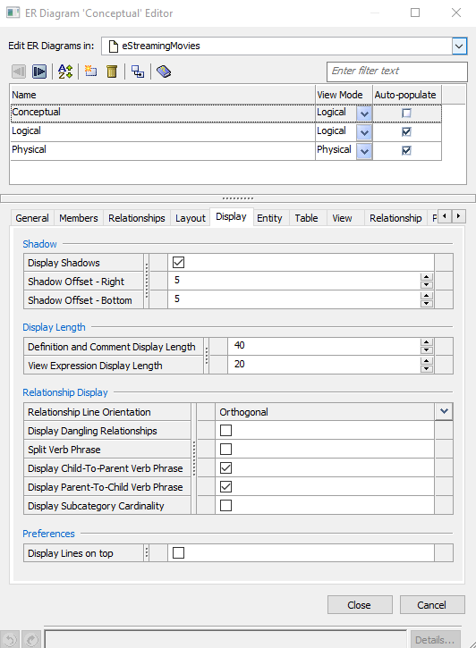
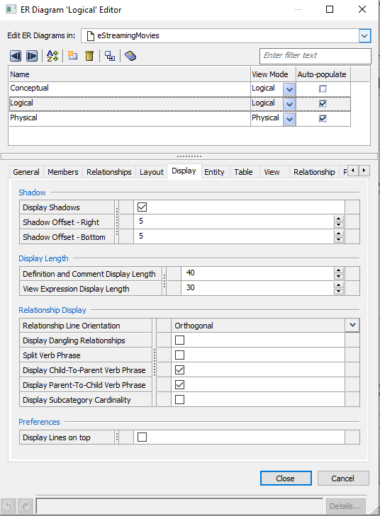
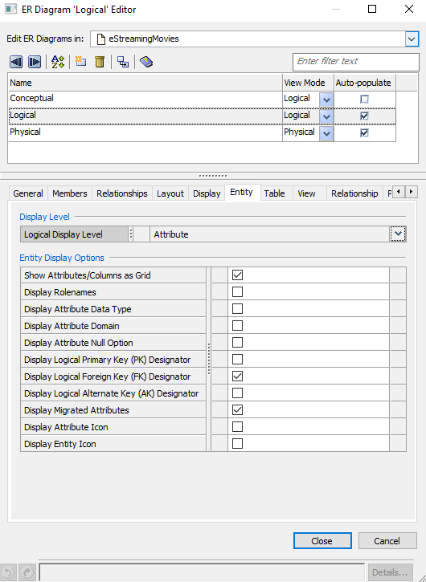
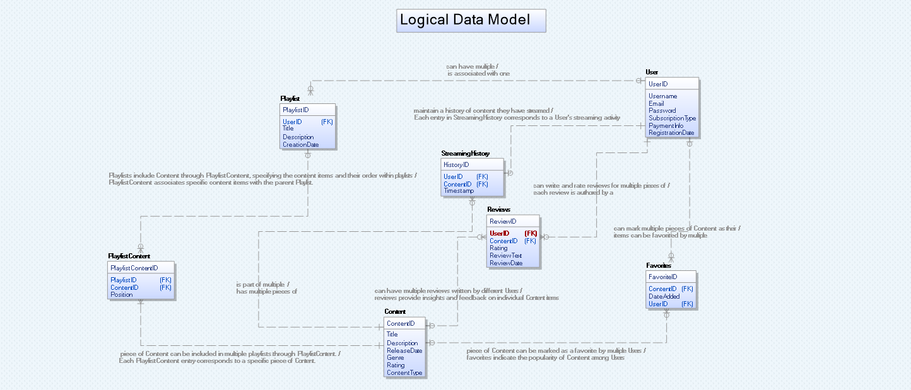
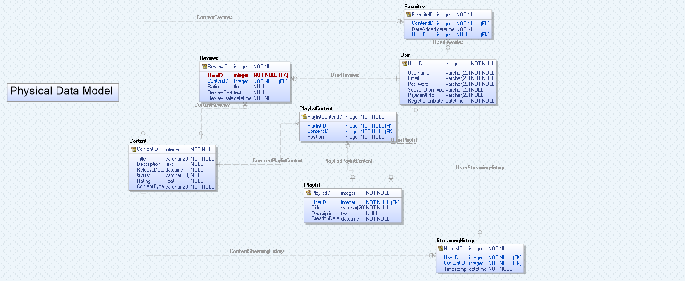

------------------------------
# Information: 

CDM (Conceptual Data Model):
The Conceptual Data Model is the highest-level data model in the data modeling process.
It focuses on understanding and representing the essential business concepts and the relationships between them, regardless of the technical details or implementation considerations.
CDM is often used to communicate with non-technical stakeholders and to establish a common understanding of the business requirements.
It doesn't involve detailed attributes or specific data types but rather provides a high-level view of the data and its interconnections.

LDM (Logical Data Model):
The Logical Data Model is the next stage in the data modeling process, following the conceptual model.
It takes the concepts and relationships identified in the CDM and refines them to include more specific details.
LDM defines entities, attributes, relationships, and constraints in a technology-neutral manner. It doesn't consider the specific database management system or implementation details.
This model serves as an intermediate step between the conceptual model and the physical data model.

PDM (Physical Data Model):
The Physical Data Model is the lowest-level data model in the data modeling process.
It represents the data structures and organization as they will be implemented in a particular database management system (DBMS).
PDM includes details like table structures, data types, indexes, keys, and storage considerations.
It is closely tied to the specific database technology chosen for implementation, making it more technical and less abstract compared to the CDM and LDM.
In summary, CDM provides a high-level, business-oriented view of data, LDM refines the model to include logical details, and PDM specifies the physical implementation details for a specific database system. These models are essential for designing effective databases that meet business requirements while also being technically sound.

------------------------------

## Table of Contents
- [Step 1](#1): First I drafted all the entites that I think would exits within a streaming service.

- [Step 2](#2): Then I drafted the relationships they would have between each other

- [Step 3](#3): Then I add the attributes I think each entity should have.

- [Step 4](#4): Further refine the relationships between each entity.

- [Step 5](#5): Next is checking what data type each attribute for the entities should be.

- [Step 6](#6): Following that is to create the first Data Model on Erwin and that is the Conceptual Data Model or the CDM. And add business definitions to each entity at this level.

- [Step 7](#7): After creating the CMD you can use the "auto populate" option under "Diagram" > "Diagrams..." 

- [Step 8](#8): Once that has been done the Physical Data Model should auto generate as well. After some modifications also some adjustments are needed to be made to the diagram itself because each model exists by itself as its own diagram.

- [Conclusions](#conclusions)

------------------------------

<a name = "1">[Step 1]</a>: First I drafted all the entites that I think would exits within a streaming service. below: 
Entities:

- Users
- Playlists
- Content
- StreamingHistory
- Favorites
- Reviews

<a name = "2">[Step 2]</a>: Then I drafted the relationships they would have between each other.

Relationships:
- Users can have multiple Playlists (One-to-Many: User to Playlist).
- Playlists can contain multiple pieces of Content (Many-to-Many: Playlist to Content).
- Users can have a StreamingHistory (One-to-Many: User to StreamingHistory).
- Users can mark Content as Favorites (Many-to-Many: User to Favorites).
- Users can write and rate Reviews for Content (One-to-Many: User to Reviews).
- StreamingHistory records which Content Users have watched (Many-to-One: StreamingHistory to User, Many-to-One: StreamingHistory to Content).
- Content can have multiple Reviews and be favorited by multiple Users (One-to-Many: Content to Reviews, One-to-Many: Content to Favorites).
- Playlists contain Content through PlaylistContent (One-to-Many: Playlist to PlaylistContent).

<a name = "3">[Step 3]</a>: Then I add the attributes I think each entity should have. 

--------------------------------
User Table
- UserID (Primary Key)
- Username
- Email
- Password
- SubscriptionType
- PaymentInfo
- RegistrationDate
--------------------------------
Playlist Table:
- PlaylistID (Primary Key)
- UserID (Foreign Key)
- Title
- Description
- CreationDate
--------------------------------
Content Table:
- ContentID (Primary Key)
- Title
- Description
- ReleaseDate
- Genre
- Rating
- ContentType
--------------------------------
PlaylistContent Table:
- PlaylistContentID (Primary Key)
- PlaylistID (Foreign Key)
- ContentID (Foreign Key)
- Position
--------------------------------
StreamingHistory Table:
- HistoryID (Primary Key)
- UserID (Foreign Key)
- ContentID (Foreign Key)
- Timestamp
--------------------------------
Favorites Table:
- FavoriteID (Primary Key)
- UserID (Foreign Key)
- ContentID (Foreign Key)
- DateAdded
--------------------------------
Reviews Table:
- ReviewID (Primary Key)
- UserID (Foreign Key)
- ContentID (Foreign Key)
- Rating
- ReviewText
- ReviewDate

<a name = "4">[Step 4]</a>: Further refine the relationships between each entity.

Relationships:
- One User can create and manage multiple Playlists (One-to-Many: User to Playlist).
- Each Playlist is associated with one User through the UserID foreign key.
- Playlists can contain multiple pieces of Content, and Content can belong to multiple Playlists (Many-to-Many: Playlist to Content).
- Users can have a StreamingHistory, which records content they have streamed (One-to-Many: User to StreamingHistory).
- Users can mark Content as Favorites, and Content can be favorited by multiple Users (Many-to-Many: User to Favorites).
- Users can write and rate Reviews for Content (One- to- Many: User to Reviews).
- StreamingHistory records which Content Users have watched (Many- to- One: StreamingHistory to User and Many- to- One: StreamingHistory to Content).
- Content can have multiple Reviews and be favorited by multiple Users (One- to- Many: Content to Reviews and One- to- Many: Content to Favorites).
- Playlists include Content through PlaylistContent, specifying the content items and their order within playlists (One- to- Many: Playlist to PlaylistContent).

<a name = "5">[Step 5]</a>: Next is checking what data type each attribute for the entities should be.

--------------------------------
User Table:
- UserID (Primary Key) - Integer
- Username - String (varchar)
- Email - String (varchar)
- Password - String (varchar)
- SubscriptionType - String (varchar)
- PaymentInfo - String (varchar)
- RegistrationDate - Date
--------------------------------
Playlist Table:
- PlaylistID (Primary Key) - Integer
- UserID (Foreign Key) - Integer
- Title - String (varchar)
- Description - Text
- CreationDate - Date
--------------------------------
Content Table:
- ContentID (Primary Key) - Integer
- Title - String (varchar)
- Description - Text
- ReleaseDate - Date
- Genre - String (varchar)
- Rating - Decimal or Float
- ContentType - String (varchar)
--------------------------------
PlaylistContent Table:
- PlaylistContentID (Primary Key) - Integer
- PlaylistID (Foreign Key) - Integer
- ContentID (Foreign Key) - Integer
- Position - Integer
--------------------------------
StreamingHistory Table:
- HistoryID (Primary Key) - Integer
- UserID (Foreign Key) - Integer
- ContentID (Foreign Key) - Integer
- Timestamp - Timestamp or DateTime
--------------------------------
Favorites Table:
- FavoriteID (Primary Key) - Integer
- UserID (Foreign Key) - Integer
- ContentID (Foreign Key) - Integer
- DateAdded - Date
--------------------------------
Reviews Table:
- ReviewID (Primary Key) - Integer
- UserID (Foreign Key) - Integer
- ContentID (Foreign Key) - Integer
- Rating - Decimal or Float
- ReviewText - Text
- ReviewDate - Date

<a name = "6">[Step 6]</a>: Following that is to create the first Data Model on Erwin and that is the Conceptual Data Model or the CDM. And add business definitions to each entity at this level.

--------------------------------------------

--------------------------------------------

<a name = "7">[Step 7]</a>: After creating the CMD you can use the "auto populate" option under "Diagram" > "Diagrams..." 

[Step 8]: Once it has been auto populated it will generate empty entities with no attributes we can then add it ourselves once added it should look like this. Some adjustments needed to be made to the "Diagram..." section. And after adding the required views for the logical data model we can see that it shows as such.

<a name = "8">[Step 8]</a>: Once that has been done the Physical Data Model should auto generate as well. After some modifications also some adjustments are needed to be made to the diagram itself because each model exists by itself as its own diagram.

<a name = "conclusions">[Conclusions]</a>: 

This project taught me alot about creating a database. I took countless hours searching the web on tutorials and how tos. Erwin DM made it pretty easy as it was pretty intuitive after using it for so long. My take away from this project is to slow down and take things slowly I tried to rush into doing things all at once and that didn't end too well.